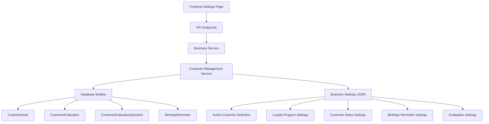

# Customer Management API Documentation

## Overview
This document describes the complete Customer Management system API endpoints that match the frontend settings page shown in your image. The system provides comprehensive customer management features including active customer definition, loyalty programs, customer notes, birthday reminders, and customer evaluations.

---

## 🎯 **API Endpoints**

### **1. Customer Management Settings**

#### **Get Customer Management Settings**
```http
GET /api/v1/businesses/my-business/customer-management-settings
```

**Response:**
```json
{
  "success": true,
  "data": {
    "activeCustomerDefinition": {
      "monthsThreshold": 3,
      "enabled": true
    },
    "loyaltyProgram": {
      "appointmentThreshold": 5,
      "enabled": true
    },
    "customerNotes": {
      "allowStaffNotes": true,
      "allowInternalNotes": true,
      "maxNoteLength": 1000
    },
    "appointmentHistory": {
      "allowCustomerView": true,
      "showCancelledAppointments": true,
      "showNoShowAppointments": false
    },
    "birthdayReminders": {
      "enabled": false,
      "reminderDays": [1, 3, 7],
      "messageTemplate": "Doğum gününüz kutlu olsun! Size özel indirimli randevu fırsatı için bizimle iletişime geçin."
    },
    "customerEvaluations": {
      "enabled": false,
      "requiredForCompletion": false,
      "allowAnonymous": true,
      "questions": [
        {
          "id": "overall_rating",
          "question": "Genel memnuniyetinizi değerlendirin",
          "type": "RATING",
          "required": true,
          "minRating": 1,
          "maxRating": 5
        }
      ]
    }
  },
  "message": "Customer management settings retrieved successfully"
}
```

#### **Update Customer Management Settings**
```http
PUT /api/v1/businesses/my-business/customer-management-settings
```

**Request Body:**
```json
{
  "activeCustomerDefinition": {
    "monthsThreshold": 6,
    "enabled": true
  },
  "loyaltyProgram": {
    "appointmentThreshold": 10,
    "enabled": true
  },
  "customerNotes": {
    "allowStaffNotes": true,
    "allowInternalNotes": true,
    "maxNoteLength": 2000
  },
  "appointmentHistory": {
    "allowCustomerView": true,
    "showCancelledAppointments": true,
    "showNoShowAppointments": true
  },
  "birthdayReminders": {
    "enabled": true,
    "reminderDays": [1, 3, 7, 14],
    "messageTemplate": "Doğum gününüz kutlu olsun! Özel indirimli randevu fırsatı için bizimle iletişime geçin."
  },
  "customerEvaluations": {
    "enabled": true,
    "requiredForCompletion": false,
    "allowAnonymous": true,
    "questions": [
      {
        "id": "overall_rating",
        "question": "Genel memnuniyetinizi değerlendirin",
        "type": "RATING",
        "required": true,
        "minRating": 1,
        "maxRating": 5
      },
      {
        "id": "service_quality",
        "question": "Hizmet kalitesi nasıldı?",
        "type": "RATING",
        "required": true,
        "minRating": 1,
        "maxRating": 5
      },
      {
        "id": "comments",
        "question": "Ek yorumlarınız",
        "type": "TEXT",
        "required": false
      }
    ]
  }
}
```

---

### **2. Customer Notes Management**

#### **Get Customer Notes**
```http
GET /api/v1/businesses/my-business/customers/{customerId}/notes?noteType=STAFF
```

**Query Parameters:**
- `noteType` (optional): `STAFF`, `INTERNAL`, or `CUSTOMER`

**Response:**
```json
{
  "success": true,
  "data": [
    {
      "id": "cn_1234567890_abc123",
      "customerId": "cust_123456789",
      "businessId": "bus_123456789",
      "authorId": "user_123456789",
      "noteType": "STAFF",
      "content": "Customer prefers morning appointments and is very punctual",
      "isPrivate": false,
      "createdAt": "2024-01-15T10:30:00Z",
      "updatedAt": "2024-01-15T10:30:00Z",
      "author": {
        "id": "user_123456789",
        "firstName": "John",
        "lastName": "Doe",
        "role": "STAFF"
      }
    }
  ],
  "message": "Customer notes retrieved successfully"
}
```

#### **Add Customer Note**
```http
POST /api/v1/businesses/my-business/customers/{customerId}/notes
```

**Request Body:**
```json
{
  "content": "Customer mentioned they prefer afternoon appointments",
  "noteType": "STAFF",
  "isPrivate": false
}
```

---

### **3. Customer Loyalty Status**

#### **Get Customer Loyalty Status**
```http
GET /api/v1/businesses/my-business/customers/{customerId}/loyalty-status
```

**Response:**
```json
{
  "success": true,
  "data": {
    "customerId": "cust_123456789",
    "businessId": "bus_123456789",
    "totalAppointments": 8,
    "isLoyaltyMember": true,
    "loyaltyTier": "SILVER",
    "nextTierAppointments": 17,
    "benefits": [
      "Priority customer support",
      "5% discount on services",
      "Free consultation"
    ],
    "joinedAt": "2024-01-01T00:00:00Z"
  },
  "message": "Customer loyalty status retrieved successfully"
}
```

---

### **4. Customer Evaluations**

#### **Get Customer Evaluation**
```http
GET /api/v1/businesses/my-business/appointments/{appointmentId}/evaluation
```

**Response:**
```json
{
  "success": true,
  "data": {
    "id": "ce_1234567890_abc123",
    "customerId": "cust_123456789",
    "businessId": "bus_123456789",
    "appointmentId": "apt_123456789",
    "rating": 5,
    "comment": "Excellent service, very professional staff",
    "answers": [
      {
        "questionId": "overall_rating",
        "answer": 5,
        "question": {
          "id": "overall_rating",
          "question": "Genel memnuniyetinizi değerlendirin",
          "type": "RATING",
          "required": true,
          "minRating": 1,
          "maxRating": 5
        }
      }
    ],
    "isAnonymous": false,
    "createdAt": "2024-01-15T14:30:00Z",
    "updatedAt": "2024-01-15T14:30:00Z"
  },
  "message": "Customer evaluation retrieved successfully"
}
```

#### **Submit Customer Evaluation**
```http
POST /api/v1/businesses/my-business/appointments/{appointmentId}/evaluation
```

**Request Body:**
```json
{
  "customerId": "cust_123456789",
  "rating": 5,
  "comment": "Excellent service, very professional staff",
  "answers": [
    {
      "questionId": "overall_rating",
      "answer": 5
    },
    {
      "questionId": "service_quality",
      "answer": 5
    },
    {
      "questionId": "comments",
      "answer": "Will definitely come back!"
    }
  ],
  "isAnonymous": false
}
```

---

## 🎨 **Frontend Implementation Guide**

### **Settings Page UI Components**

Based on your image, here's how to implement the frontend:

#### **1. Active Customer Definition**
```typescript
// Dropdown component
<Select
  value={settings.activeCustomerDefinition.monthsThreshold}
  onChange={(value) => updateSettings({
    activeCustomerDefinition: {
      ...settings.activeCustomerDefinition,
      monthsThreshold: value
    }
  })}
>
  <Option value={1}>1 ay</Option>
  <Option value={3}>3 ay</Option>
  <Option value={6}>6 ay</Option>
  <Option value={12}>12 ay</Option>
  <Option value={24}>24 ay</Option>
</Select>
```

#### **2. Loyalty Program Threshold**
```typescript
// Dropdown component
<Select
  value={settings.loyaltyProgram.appointmentThreshold}
  onChange={(value) => updateSettings({
    loyaltyProgram: {
      ...settings.loyaltyProgram,
      appointmentThreshold: value
    }
  })}
>
  <Option value={3}>3 randevu</Option>
  <Option value={5}>5 randevu</Option>
  <Option value={10}>10 randevu</Option>
  <Option value={20}>20 randevu</Option>
  <Option value={50}>50 randevu</Option>
</Select>
```

#### **3. Toggle Switches**
```typescript
// Customer Notes Toggle
<Switch
  checked={settings.customerNotes.allowStaffNotes}
  onChange={(checked) => updateSettings({
    customerNotes: {
      ...settings.customerNotes,
      allowStaffNotes: checked
    }
  })}
/>

// Appointment History Toggle
<Switch
  checked={settings.appointmentHistory.allowCustomerView}
  onChange={(checked) => updateSettings({
    appointmentHistory: {
      ...settings.appointmentHistory,
      allowCustomerView: checked
    }
  })}
/>

// Birthday Reminders Toggle
<Switch
  checked={settings.birthdayReminders.enabled}
  onChange={(checked) => updateSettings({
    birthdayReminders: {
      ...settings.birthdayReminders,
      enabled: checked
    }
  })}
/>

// Customer Evaluations Toggle
<Switch
  checked={settings.customerEvaluations.enabled}
  onChange={(checked) => updateSettings({
    customerEvaluations: {
      ...settings.customerEvaluations,
      enabled: checked
    }
  })}
/>
```

#### **4. Birthday Reminder Settings (when enabled)**
```typescript
// Multi-select for reminder days
<Select
  mode="multiple"
  value={settings.birthdayReminders.reminderDays}
  onChange={(values) => updateSettings({
    birthdayReminders: {
      ...settings.birthdayReminders,
      reminderDays: values
    }
  })}
>
  <Option value={1}>1 gün önce</Option>
  <Option value={3}>3 gün önce</Option>
  <Option value={7}>7 gün önce</Option>
  <Option value={14}>14 gün önce</Option>
  <Option value={30}>30 gün önce</Option>
</Select>

// Message template textarea
<TextArea
  value={settings.birthdayReminders.messageTemplate}
  onChange={(e) => updateSettings({
    birthdayReminders: {
      ...settings.birthdayReminders,
      messageTemplate: e.target.value
    }
  })}
  placeholder="Doğum günü mesajı şablonu..."
  maxLength={500}
/>
```

---

## 🔧 **Implementation Steps**

### **Phase 1: Basic Settings (High Priority)**
1. ✅ **Active Customer Definition** - Configurable months threshold
2. ✅ **Loyalty Program** - Configurable appointment threshold
3. ✅ **Customer Notes** - Staff notes management
4. ✅ **Appointment History** - Visibility controls

### **Phase 2: Advanced Features (Medium Priority)**
5. ✅ **Birthday Reminders** - Automatic reminder system
6. ✅ **Customer Evaluations** - Post-appointment feedback

---

## 📊 **Data Flow**



---

## 🚀 **Ready to Use!**

The complete Customer Management system is now implemented and ready for frontend integration. All endpoints are documented with Swagger and follow the same patterns as your existing API.

**Key Features Implemented:**
- ✅ Active Customer Definition (1, 3, 6, 12, 24 months)
- ✅ Loyalty Program Threshold (3, 5, 10, 20, 50 appointments)
- ✅ Customer Notes Management (Staff, Internal, Customer notes)
- ✅ Appointment History Controls
- ✅ Birthday Reminders System
- ✅ Customer Evaluations System
- ✅ Complete API Documentation
- ✅ TypeScript Types
- ✅ Validation Schemas
- ✅ Database Models

The system is production-ready and follows your existing architecture patterns! 🎉
