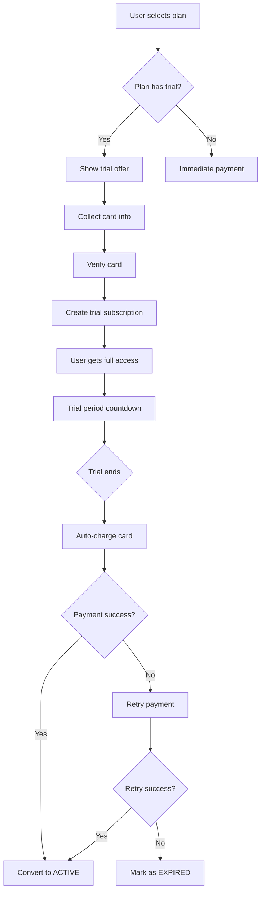
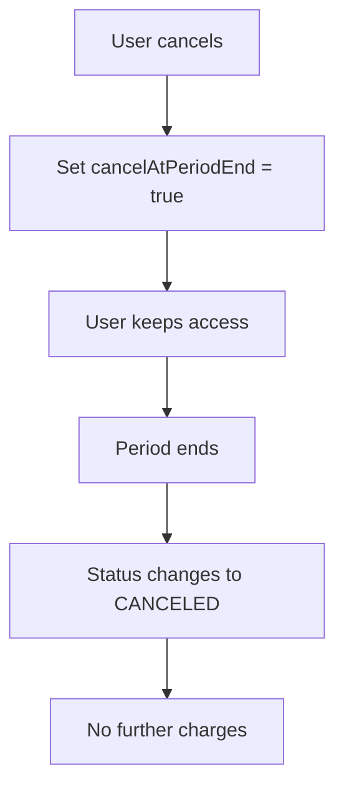

# Subscription Trial Flow Documentation

## Overview

This document explains the new 7-day free trial system for subscription plans, including API endpoints, request/response schemas, and frontend integration guidelines.

## 🎯 Key Features

- **7-day free trial** for basic plans only
- **No trial** for premium plans (immediate payment required)
- **Credit card required upfront** (stored securely, not charged during trial)
- **Automatic conversion** to paid subscription after trial period
- **Industry-standard retry logic** (3 attempts over 3 days)
- **Proper cancellation handling** (access until period end)

## 📋 Plan Configuration

### Trial Periods by Plan Type

| Plan Type | Trial Days | Example Plans |
|-----------|------------|---------------|
| Basic | 7 days | `basic_tier1`, `basic_tier2`, `basic_tier3` |
| Premium | 0 days (no trial) | `premium_tier1`, `premium_tier2`, `premium_tier3` |
| Other | 0 days | Custom plans without trial |

## 🔌 API Endpoints

### 1. Get Available Plans

**Endpoint:** `GET /api/v1/subscriptions/plans`

**Query Parameters:**
- `city` (optional): City for location-based pricing
- `state` (optional): State for location-based pricing  
- `country` (optional): Country for location-based pricing (default: Turkey)

**Response Schema:**
```typescript
{
  "success": true,
  "data": [
    {
      "id": "plan_basic_tier1",
      "name": "basic_tier1",
      "displayName": "Basic Plan - Tier 1",
      "description": "Perfect for small businesses in major cities",
      "price": 949.00,
      "currency": "TRY",
      "billingInterval": "MONTHLY",
      "features": {
        "trialDays": 7,
        "pricingTier": "TIER_1",
        "description": [
          "Online appointment booking system",
          "Up to 1 staff member",
          "Unlimited customers",
          // ... more features
        ]
      },
      "isActive": true,
      "isPopular": false,
      "sortOrder": 1
    }
    // ... more plans
  ]
}
```

### 2. Create Subscription (Trial)

**Endpoint:** `POST /api/v1/subscriptions/business/{businessId}/subscribe`

**Request Schema:**
```typescript
{
  "planId": "plan_basic_tier1",
  "card": {
    "cardHolderName": "John Doe",
    "cardNumber": "5528790000000008",
    "expireMonth": "12",
    "expireYear": "2030",
    "cvc": "123"
  },
  "buyer": {
    "name": "John",
    "surname": "Doe", 
    "email": "john.doe@example.com",
    "gsmNumber": "+905350000000",
    "address": "Test Address, Istanbul",
    "city": "Istanbul",
    "country": "Turkey",
    "zipCode": "34000"
  }
}
```

**Response Schema (Trial Created):**
```typescript
{
  "success": true,
  "message": "Business subscribed successfully",
  "data": {
    "id": "bs_1703123456789_abc123",
    "businessId": "biz_12345",
    "planId": "plan_basic_tier1",
    "status": "TRIAL",
    "currentPeriodStart": "2024-01-15T10:00:00.000Z",
    "currentPeriodEnd": "2024-01-22T10:00:00.000Z",
    "trialStart": "2024-01-15T10:00:00.000Z",
    "trialEnd": "2024-01-22T10:00:00.000Z",
    "cancelAtPeriodEnd": false,
    "autoRenewal": true,
    "paymentMethodId": "pm_1703123456789_xyz789",
    "metadata": {
      "trialDays": 7,
      "requiresPaymentMethod": true,
      "createdAt": "2024-01-15T10:00:00.000Z"
    },
    "createdAt": "2024-01-15T10:00:00.000Z",
    "updatedAt": "2024-01-15T10:00:00.000Z"
  }
}
```

### 3. Get Business Subscription

**Endpoint:** `GET /api/v1/subscriptions/business/{businessId}`

**Response Schema:**
```typescript
{
  "success": true,
  "data": {
    "id": "bs_1703123456789_abc123",
    "businessId": "biz_12345",
    "planId": "plan_basic_tier1",
    "status": "TRIAL", // or "ACTIVE", "CANCELED", "EXPIRED"
    "currentPeriodStart": "2024-01-15T10:00:00.000Z",
    "currentPeriodEnd": "2024-01-22T10:00:00.000Z",
    "trialStart": "2024-01-15T10:00:00.000Z",
    "trialEnd": "2024-01-22T10:00:00.000Z",
    "cancelAtPeriodEnd": false,
    "autoRenewal": true,
    "paymentMethodId": "pm_1703123456789_xyz789",
    "nextBillingDate": "2024-01-22T10:00:00.000Z",
    "failedPaymentCount": 0,
    "metadata": {
      "trialDays": 7,
      "requiresPaymentMethod": true
    },
    "createdAt": "2024-01-15T10:00:00.000Z",
    "updatedAt": "2024-01-15T10:00:00.000Z"
  }
}
```

### 4. Cancel Subscription

**Endpoint:** `POST /api/v1/subscriptions/business/{businessId}/cancel`

**Request Schema:**
```typescript
{
  "cancelAtPeriodEnd": true // Default: true (recommended)
}
```

**Response Schema:**
```typescript
{
  "success": true,
  "message": "Subscription will be cancelled at period end",
  "data": {
    "id": "bs_1703123456789_abc123",
    "businessId": "biz_12345",
    "planId": "plan_basic_tier1",
    "status": "TRIAL", // Status remains same until period end
    "currentPeriodEnd": "2024-01-22T10:00:00.000Z",
    "cancelAtPeriodEnd": true, // Now set to true
    "canceledAt": null, // Will be set when period ends
    "autoRenewal": true,
    "paymentMethodId": "pm_1703123456789_xyz789",
    "createdAt": "2024-01-15T10:00:00.000Z",
    "updatedAt": "2024-01-15T10:00:00.000Z"
  }
}
```

## 🎨 Frontend Integration Guide

### 1. Plan Selection UI

```typescript
// Example React component for plan selection
interface Plan {
  id: string;
  name: string;
  displayName: string;
  price: number;
  currency: string;
  features: {
    trialDays: number;
    description: string[];
  };
}

const PlanCard = ({ plan }: { plan: Plan }) => {
  const hasTrial = plan.features.trialDays > 0;
  const isBasicPlan = plan.name.includes('basic');
  
  return (
    <div className="plan-card">
      <h3>{plan.displayName}</h3>
      <div className="price">
        {hasTrial && isBasicPlan ? (
          <>
            <span className="trial-badge">
              7-day free trial
            </span>
            <span className="trial-price">Free for 7 days</span>
            <span className="after-trial">
              Then {plan.price} {plan.currency}/month
            </span>
          </>
        ) : (
          <span className="regular-price">
            {plan.price} {plan.currency}/month
          </span>
        )}
      </div>
      <ul className="features">
        {plan.features.description.map((feature, index) => (
          <li key={index}>{feature}</li>
        ))}
      </ul>
      <button className="select-plan-btn">
        {hasTrial && isBasicPlan ? 'Start Free Trial' : 'Subscribe Now'}
      </button>
    </div>
  );
};
```

### 2. Trial Subscription Form

```typescript
// Example subscription form for trial plans
interface TrialSubscriptionFormProps {
  planId: string;
  businessId: string;
  onSuccess: (subscription: any) => void;
}

const TrialSubscriptionForm = ({ planId, businessId, onSuccess }: TrialSubscriptionFormProps) => {
  const [formData, setFormData] = useState({
    card: {
      cardHolderName: '',
      cardNumber: '',
      expireMonth: '',
      expireYear: '',
      cvc: ''
    },
    buyer: {
      name: '',
      surname: '',
      email: '',
      gsmNumber: '',
      address: '',
      city: '',
      country: 'Turkey',
      zipCode: ''
    }
  });

  const handleSubmit = async (e: React.FormEvent) => {
    e.preventDefault();
    
    try {
      const response = await fetch(`/api/v1/subscriptions/business/${businessId}/subscribe`, {
        method: 'POST',
        headers: {
          'Content-Type': 'application/json',
          'Authorization': `Bearer ${userToken}`
        },
        body: JSON.stringify({
          planId,
          ...formData
        })
      });

      const result = await response.json();
      
      if (result.success) {
        onSuccess(result.data);
        // Show success message with trial details
        showTrialSuccessMessage(result.data);
      } else {
        throw new Error(result.error || 'Subscription failed');
      }
    } catch (error) {
      console.error('Subscription error:', error);
      // Show error message
    }
  };

  return (
    <form onSubmit={handleSubmit} className="trial-subscription-form">
      <div className="card-section">
        <h3>Payment Information</h3>
        <p className="trial-notice">
          Your card will be verified but not charged during the trial period.
        </p>
        {/* Card form fields */}
      </div>
      
      <div className="buyer-section">
        <h3>Billing Information</h3>
        {/* Buyer form fields */}
      </div>
      
      <button type="submit" className="start-trial-btn">
        Start 7-Day Free Trial
      </button>
    </form>
  );
};
```

### 3. Subscription Status Display

```typescript
// Example component to display subscription status
interface SubscriptionStatusProps {
  subscription: any;
}

const SubscriptionStatus = ({ subscription }: SubscriptionStatusProps) => {
  const getStatusInfo = (status: string, trialEnd?: string) => {
    switch (status) {
      case 'TRIAL':
        const daysLeft = trialEnd ? 
          Math.ceil((new Date(trialEnd).getTime() - Date.now()) / (1000 * 60 * 60 * 24)) : 0;
        return {
          label: 'Free Trial',
          color: 'blue',
          message: `${daysLeft} days left in trial`,
          showCancel: true
        };
      case 'ACTIVE':
        return {
          label: 'Active',
          color: 'green',
          message: 'Subscription is active',
          showCancel: true
        };
      case 'CANCELED':
        return {
          label: 'Canceled',
          color: 'red',
          message: 'Subscription canceled',
          showCancel: false
        };
      case 'EXPIRED':
        return {
          label: 'Expired',
          color: 'red',
          message: 'Trial expired - subscription required',
          showCancel: false
        };
      default:
        return {
          label: 'Unknown',
          color: 'gray',
          message: 'Unknown status',
          showCancel: false
        };
    }
  };

  const statusInfo = getStatusInfo(subscription.status, subscription.trialEnd);

  return (
    <div className="subscription-status">
      <div className={`status-badge ${statusInfo.color}`}>
        {statusInfo.label}
      </div>
      <p className="status-message">{statusInfo.message}</p>
      
      {subscription.trialEnd && subscription.status === 'TRIAL' && (
        <div className="trial-countdown">
          <p>Trial ends: {new Date(subscription.trialEnd).toLocaleDateString()}</p>
          <p>You'll be automatically charged after the trial period.</p>
        </div>
      )}
      
      {statusInfo.showCancel && (
        <button 
          className="cancel-subscription-btn"
          onClick={() => handleCancelSubscription()}
        >
          Cancel Subscription
        </button>
      )}
    </div>
  );
};
```

### 4. Trial Conversion Notifications

```typescript
// Example notification handling for trial conversions
const useTrialNotifications = (subscription: any) => {
  useEffect(() => {
    if (subscription.status === 'TRIAL' && subscription.trialEnd) {
      const trialEndDate = new Date(subscription.trialEnd);
      const now = new Date();
      const daysLeft = Math.ceil((trialEndDate.getTime() - now.getTime()) / (1000 * 60 * 60 * 24));

      // Show notifications based on days left
      if (daysLeft === 3) {
        showNotification('Your trial ends in 3 days. Update your payment method if needed.');
      } else if (daysLeft === 1) {
        showNotification('Your trial ends tomorrow. You will be charged automatically.');
      } else if (daysLeft === 0) {
        showNotification('Your trial ends today. Payment will be processed automatically.');
      }
    }
  }, [subscription]);
};
```

## 🔄 Subscription Lifecycle

### Trial Flow



### Cancellation Flow



## 🚨 Error Handling

### Common Error Responses

```typescript
// Invalid card information
{
  "success": false,
  "error": "Invalid card information",
  "code": "INVALID_CARD"
}

// Plan not found
{
  "success": false,
  "error": "Subscription plan not found",
  "code": "PLAN_NOT_FOUND"
}

// Business already has subscription
{
  "success": false,
  "error": "Business already has an active subscription",
  "code": "SUBSCRIPTION_EXISTS"
}

// Payment method required for trial
{
  "success": false,
  "error": "Payment method is required for trial subscriptions",
  "code": "PAYMENT_METHOD_REQUIRED"
}
```

## 📊 Status Codes Reference

| Status | Description | User Action Required |
|--------|-------------|---------------------|
| `TRIAL` | Free trial active | None - full access |
| `ACTIVE` | Paid subscription active | None - full access |
| `CANCELED` | Subscription canceled | Subscribe to regain access |
| `EXPIRED` | Trial expired, payment failed | Update payment method and resubscribe |
| `PAST_DUE` | Payment failed, retrying | Update payment method |
| `UNPAID` | Payment required | Complete payment |

## 🔧 Development Notes

### Testing Cards (Iyzico Sandbox)

```typescript
// Successful payment test cards
const testCards = {
  visa: {
    number: '4766620000000001',
    expiry: '12/30',
    cvc: '123'
  },
  mastercard: {
    number: '5528790000000008', 
    expiry: '12/30',
    cvc: '123'
  }
};

// Failed payment test cards
const failedCards = {
  insufficientFunds: {
    number: '5406670000000009',
    expiry: '12/30', 
    cvc: '123'
  },
  invalidCard: {
    number: '4111111111111129',
    expiry: '12/30',
    cvc: '123'
  }
};
```

### Cron Job Schedule

- **Production**: Daily at 2 AM (Europe/Istanbul timezone)
- **Development**: Every minute for testing
- **Tasks**: Trial conversions, subscription renewals, cleanup

## 🎯 Best Practices

### Frontend Implementation

1. **Show trial information only for basic plans** (7-day trial)
2. **Collect payment method upfront** for basic plan trials only
3. **Display clear trial countdown** and conversion messaging
4. **Handle all subscription statuses** appropriately
5. **Provide easy cancellation** with clear messaging about access duration
6. **Show payment method management** for active subscriptions

### Security Considerations

1. **Never store full card numbers** in frontend
2. **Use HTTPS** for all payment-related requests
3. **Validate card information** before submission
4. **Handle payment failures** gracefully
5. **Store payment method tokens** securely on backend

## 📞 Support

For technical questions about the subscription system:

- **Backend Issues**: Check server logs and cron job status
- **Payment Issues**: Verify Iyzico integration and test cards
- **Trial Conversion**: Check scheduler service and payment method validity
- **Cancellation**: Verify `cancelAtPeriodEnd` flag and period end dates

---

*This documentation covers the complete trial subscription flow implementation. For additional details, refer to the source code in the respective service files.*
